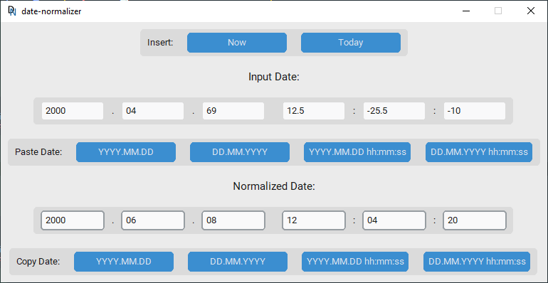
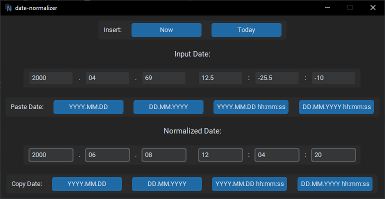

# date-normalizer

If some unwise person sent you a date as peculiar as `2000.04.69 12.5:-25.5:-10`, this program is ready to decode this cryptic information for you.

## Supported Input

Days, hours, minutes, and seconds can be any float, positive or negative, as long as the resulting year falls within the range from 1 to 9999.

Years and months cannot be normalized because they represent inconsistent units of time (with months having varying numbers of days and leap years), so they are constrained to the ranges of 1 to 9999 and 1 to 12, respectively.

## Command line

```plaintext
usage: main.py [-h] [-i IFORMAT] [-o OFORMAT] [--ui] [date]

Normalize date

positional arguments:
  date                  date to normalize

options:
  -h, --help            show this help message and exit
  -i IFORMAT, --iformat IFORMAT
                        input date format, default=%Y.%m.%d %H:%M:%S
  -o OFORMAT, --oformat OFORMAT
                        output date format, default=IFORAMT
  --ui                  run UI instead of command line
```

If no arguments are specified, it'll open the UI.

For bash, you can use `date-normalizer`, which is just a shortcut for `python main.py`.

## User Interface




(theme depends on system settings)

## Building .exe

To create the executable, follow these steps:

1. Install PyInstaller and dependencies:

    ```bash
    pip install pyinstaller
    pip install -r requirements.txt
    ```

2. Run the following command (ensure `pyinstaller` is installed in the same environment as the dependencies):

    ```bash
    pyinstaller --noconfirm --onefile --windowed --name "date_normalizer" --icon "icon.ico" --add-data "icon.ico:." "main.py"
    ```

    - `--noconfirm`: Skip confirmation prompts.
    - `--onefile`: Bundle the executable into a single file.
    - `--windowed`: Run the application without a console window, use `--console` for it to work from a terminal.
    - `--name "date_normalizer"`: Set the name of the executable.
    - `--icon "icon.ico"`: Set the icon for the executable.
    - `--add-data "icon.ico:."`: Include the icon file in the executable.

3. The `.exe` will be located in the `.\dist` folder.

Make sure to set up a virtual environment before installing dependencies to avoid conflicts. For troubleshooting and additional options, refer to the PyInstaller documentation.

## License

This project is licensed under the [MIT License](LICENSE.md).
